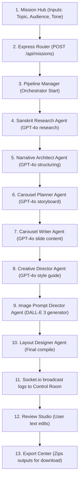

# Project Architecture, Flow, and MVC Structure

This document outlines the architecture, data flow, Model-View-Controller (MVC) structure, and key technical details of the **Shruti Sadhana AI Studio** automation pipeline.

---

## 1. System Data Flow

The following diagrams illustrate how data flows from the user inputs in the React UI, through the Express server and WebSocket connection, sequentially execution across the 7 AI Agents, and finally returning to the UI for preview and export.

#### Detailed ASCII Architecture Flow Diagram
```text
  [STEP 1: USER INPUT]
         │
         ▼
  [STEP 2: EXPRESS SERVER (POST /api/missions)]
         │
         ▼
  [STEP 3: MISSION MANAGER (Orchestration & Background Job)]
         │
         ▼
  [STEP 4: SEQUENTIAL AI AGENTS PIPELINE (One-way Flow)]
  ┌─────────────────────────────────────────────────────────────┐
  │  (Input: Topic)                                             │
  │  [Agent 1: Sanskrit Research] (Gathers shloka translation)  │
  │              │                                              │
  │              ▼                                              │
  │  [Agent 2: Narrative Architect] (Shapes storytelling theme) │
  │              │                                              │
  │              ▼                                              │
  │  [Agent 3: Carousel Planner] (Structures slides logically)  │
  │              │                                              │
  │              ▼                                              │
  │  [Agent 4: Carousel Writer] (Drafts text and caption tags)  │
  │              │                                              │
  │              ▼                                              │
  │  [Agent 5: Creative Director] (Defines look, colors, fonts)  │
  │              │                                              │
  │              ▼                                              │
  │  [Agent 6: Image Prompt Director] (DALL-E 3 graphic prompt) │
  │              │                                              │
  │              ▼                                              │
  │  [Agent 7: Layout Designer] (Positions visual typography)   │
  │              │                                              │
  │              ▼                                              │
  │  (Output: Slide texts + Generated DALL-E image URLs)        │
  └──────────────────────────────┬──────────────────────────────┘
                                 │
                                 ▼
  [STEP 5: REAL-TIME FEEDBACK (Socket.io broadcasts logs to UI Control Room)]
                                 │
                                 ▼
  [STEP 6: CONTENT REVIEW (User edits generated texts in Review Studio)]
                                 │
                                 ▼
  [STEP 7: EXPORT FILE (ZIP download generated with assets)]
```

### Markdown-Rendered Flowchart (Mermaid)


---

## 2. MVC (Model-View-Controller) Structure

To keep the application highly organized, modular, and easy to maintain, we map our components to the classic MVC pattern:

### 📁 The Model (Data & State)
Represents the structural definitions and data storage of our application.
*   **Mission State Database (SQLite / MongoDB / Local JSON storage):**
    *   Defines what a `Mission` object looks like: `id`, `topic`, `platform`, `tone`, `status` (pending, active, completed, failed), `currentAgentIndex`, `logs` (array of log messages), `slides` (array of slide text and image URLs), `caption`, `hashtags`, and `qualityScores`.
*   **Agent Prompts & Schemas:**
    *   The raw system instructions, target schemas, and prompt templates utilized by the LLMs for structured execution.

### 📁 The View (Presentation Layer)
Built with React, Vite, and Bootstrap to deliver a high-quality dashboard experience.
*   **Mission Hub:** Renders input forms, platform selection, tone dropdowns, and configurations.
*   **AI Control Room:** Displays progress bars, active agent status (Running, Completed, Waiting), and live log feeds connected directly to WebSockets.
*   **Review Studio:** Renders interactive preview cards for each generated slide, allowing inline editing, regeneration triggers, and a dashboard for quality score gauges.
*   **Export Center:** Renders download settings (format, quality) and previews the finalized carousel file structure before packaging.

### 📁 The Controller (Application Logic)
Acts as the orchestrator connecting the Views (User Actions) to the Models/Agents.
*   `missionController.js`: Receives requests to launch a mission, tracks its execution status, updates edited texts from the Review Studio, and saves final data.
*   `exportController.js`: Compiles generated resources, writes them to temporary folders, compiles the text files and images, and packages them into a `.zip` archive for client download.
*   `socketController.js`: Manages standard WebSocket events for broadcasting mission logs and execution milestones.

---

## 3. Technicalities & Execution Mechanics

### A. Sequential Context Passing (The "Chain" Pattern)
Each agent in the pipeline relies on the outputs of the previous agent. Because the context window must remain clean and relevant:
1.  **Agent 1 (Sanskrit Research):** Receives the raw shloka/topic, researches authentic translations and historical meanings.
2.  **Agent 2 (Narrative Architect):** Takes the raw research and transforms it into a compelling storyboard narrative.
3.  **Agent 3 (Carousel Planner):** Takes the storyboard and plans the logical breakdown for the carousel slides (e.g. Slide 1: Hook, Slide 2: Core Lesson, Slide 3: Call to Action).
4.  **Agent 4 (Carousel Writer):** Takes the structure and drafts the exact copy (Sanskrit text, English translation, body explanation) for each slide, plus caption and hashtags.
5.  **Agent 5 (Creative Director):** Reviews the copy and determines the visual mood, colors, fonts, and thematic assets.
6.  **Agent 6 (Image Prompt Director):** Converts visual styles and slide text into optimized DALL-E image prompt parameters.
7.  **Agent 7 (Layout Designer):** Standardizes overlays, layout metadata, text placement rules, and exports final visual outputs.

### B. Handling Long-Running HTTP Connections
*   AI generation requests (especially image generation and deep multi-stage text prompts) take significantly longer than the standard 30-second timeout of web browsers.
*   **Solution:** When the user clicks "Launch Mission," the backend immediately returns a `202 Accepted` status with a `missionId` and launches the pipeline asynchronously. The React client then hooks into the status socket room for that `missionId` to monitor the pipeline's progress live.

### C. Real-Time Logging & Streaming
*   Using **Socket.io**, whenever an agent updates its status or logs a diagnostic action (e.g., `Agent 4 starts writing Slide 2...`), it pushes a payload containing `{ missionId, agentIndex, status, message }` to the room.
*   The frontend listens to these events to dynamically update progress gauges and scroll down logs in real-time.

### D. Automated Content Export Package
*   The final export creates a `.zip` package containing:
    *   Individual slide images (PNG/JPEG format).
    *   `caption.txt` containing the compiled caption text.
    *   `hashtags.txt` containing the selected hashtags.
*   This is achieved on the server-side using the `adm-zip` Node package to create, populate, and pipe a ZIP file stream directly to the browser response.
